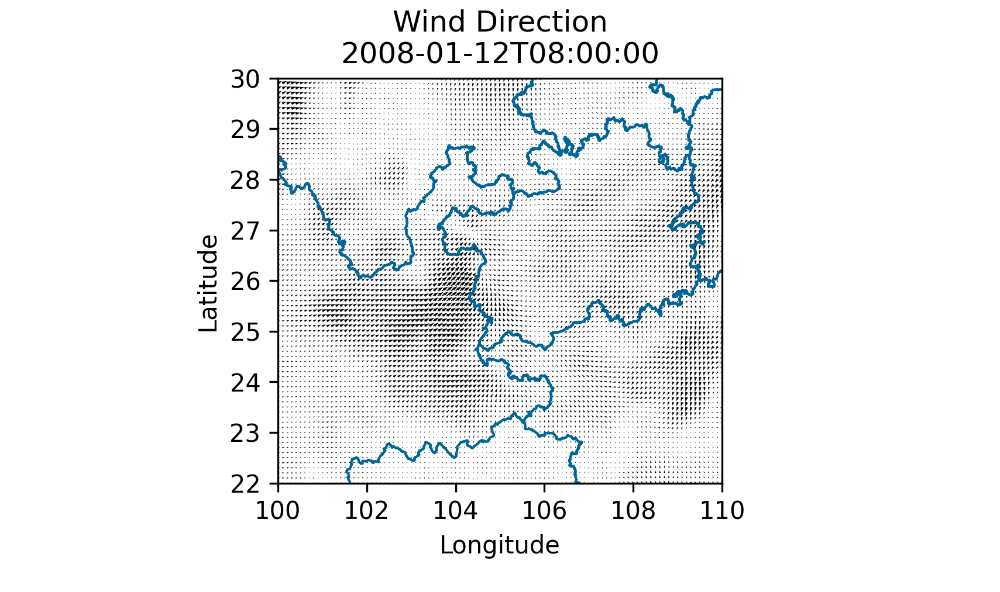
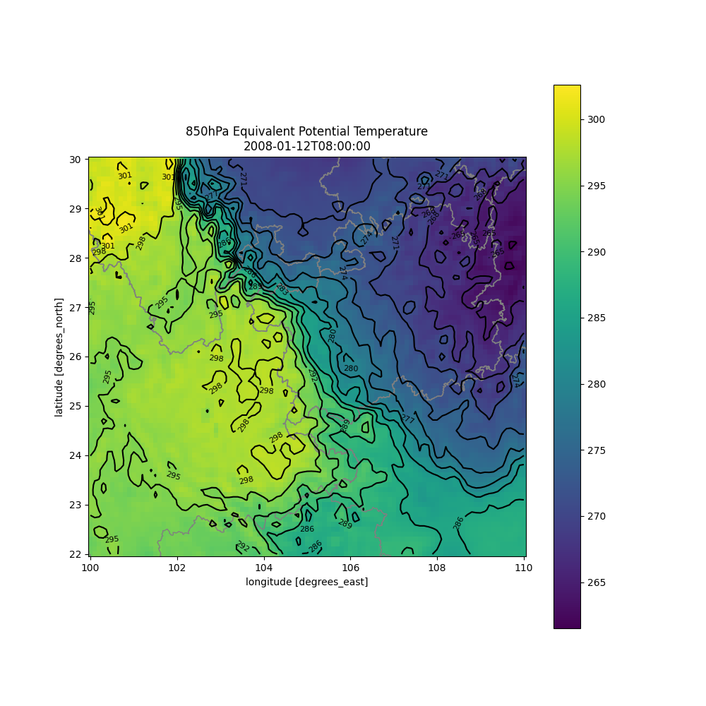
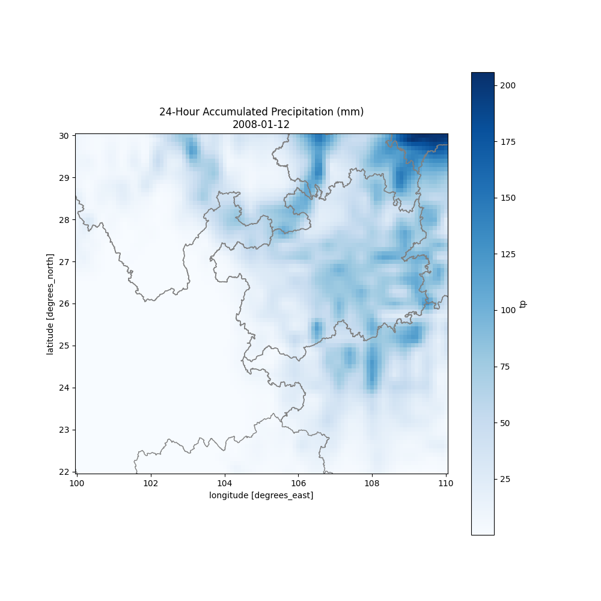
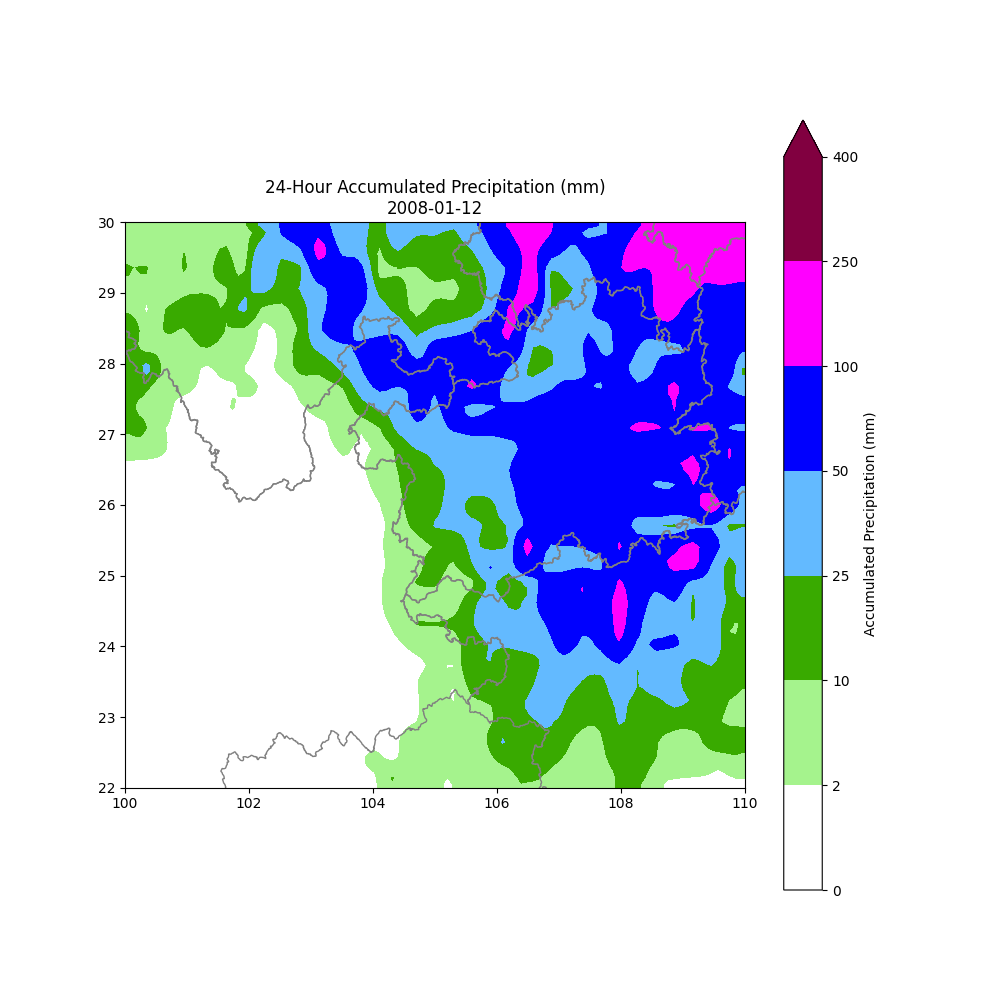

# Kunming-Front-Location
The teamwork of Atmospheric Physical Lesson
大气物理学的小组作业

## 作业内容 | Homework info
利用位温和假相当位温识别一次昆明准静止锋的演变过程，考察静止锋出现前后气象要素的变化

### 理论数据资料 | Data requirements
ERA5地表12-2月逐小时气温、露点温度、降水、云、气压和UV风场

### 要求 | Request
两人为小组完成课题，最终以 Powerpoint 形式每组 5min 上台展现成果，由同学们互相打分获得成绩

## 任务清单 | Lists
- [x] ERA5数据的下载
- [x] 对位温进行计算以及绘图
- [x] 利用UV风场看其风向的变化
- [x] ~~计算出锋线的位置~~
- [x] 绘制**昆明-贵阳**的**气温/气压-时间**图
- [ ] 降水绘制
- [x] 风向图
- [x] 对假相当位温进行计算以及绘图
- [x] 地形图
- [ ] 地形剖面图
- [ ] 考察静止锋出现前后气象要素的变化
- [ ] 制作gif文件
- [ ] 做 Powerpoint
- [ ] 汇报 **[时间：2024/05/08]**

## 目前成果 | Current results
### *Vapor*
>1. 850hPa的位温分层设色图

>2. 850hPa的等值线图

>3. 850hPa的等值线图-( `#FFFFCC` 是西南风， `#FFCCCC` 是东北风)

>4. 相当位温图，还需要修正一下关于lable以及相关算法
>5. 区域内地形图
>6. 区域内剖面图，以昆明到贵阳为例
样式1
样式2

### *Milkdog*
>1. 风向图
>2. 降采样风向图
>3. 三个站点气温随时间图

### *Needruirui*
>1. 位温+等值线图
>2. 降水图
>3. 降水图加上了不同类型的颜色

## 参考资料 | References
> 1.  [中国行政区划矢量图](https://github.com/GaryBikini/ChinaAdminDivisonSHP) 
> GaryBikini/ChinaAdminDivisonSHP: v24.02.06, 2024, DOI: [10.5281/zenodo.10624971](https://zenodo.org/badge/latestdoi/269489269)
> 2.  [ERA5-Land hourly data from 1950 to present](https://cds.climate.copernicus.eu/cdsapp#!/dataset/reanalysis-era5-land) 
> This page illustrates the procedure to cite the ERA5-Land hourly data from 1950 to present dataset and provide appropriate attribution. This dataset is generated under the framework of the Copernicus Climate Change Service (C3S). For such dataset, the Licence to use Copernicus products only applies.
> 3. [図形式配信資料における相当温位の算出方式の変更について](https://www.data.jma.go.jp/suishin/jyouhou/pdf/371.pdf)